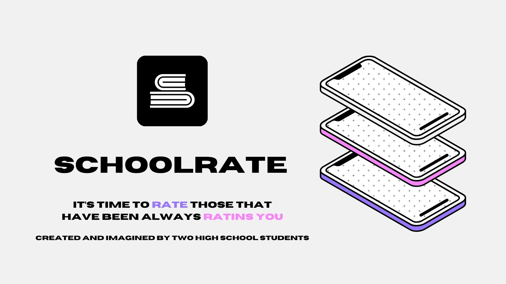

# SchoolRate for iOS, macOS and visionOS

SchoolRate is a groundbreaking school rating application crafted with students in mind, providing an intuitive platform across various devices and operating systems. Developed by students themselves, this app offers a user-friendly interface paired with powerful features, ensuring a seamless experience for anyone seeking insights into educational institutions. SchoolRate is your go-to source for transparent and comprehensive school ratings, providing valuable information in a visually appealing and easily accessible manner.

> [!NOTE]
> SchoolRate is currently in development and not yet ready for production use. You are welcome to test the [latest alpha/dev build](https://github.com/SchoolRate/SchoolRate/releases/latest) at your own risk. We welcome feedback [here](https://github.com/SchoolRate/SchoolRate/issues).

## Motivation

The idea of SchoolRate came to us after we all had, at one point or another in our curriculum, issues with our teachers, or thought that we could improve the way they educate us. Even if we can talk to our teachers to adress these issues (and we already did), we believe that we aren't the only ones in France who suffer from pedagogical issues, and this is why we've had the idea of creating SchoolRate. We aren't perfect either, and are on track to become the ones who "rate those who rate". But that doesn't mean you can't rate us, and we are looking for feedback during the development of the application.

## Mission

SchoolRate will strive to deliver a great application, with rich functionality, while not diverting from the primary goal of making education better.
  
## Features

<!--
## Pricing
-->

## Contributing
Be part of the next revolution in school rating by contributing to SchoolRate. This is a community-led effort, so we welcome as many contributors who can help. Read the [Contribution Guide](COUNTRIBUTING.md) for more information.

This project spans [multiple repositories]() so instead of browsing issues in the issues tab, it may be helpful to find an issue to get started on in our [project board]().

For issues we want to focus on that are most relevant at any given time, please see the issues scoped to our current iteration [here]().

## License

Upon creating a SchoolRate account, you are consenting to adhere to both our License Agreement and the licenses associated with our third-party packages.

The project operates under the Apache 2.0 License, a permissive license that permits the distribution of the software under specific terms and conditions. Read our License Agreement [here](LICENSE).

## Support Us
Your support is valuable to us and helps us dedicate more time to enhancing and maintaining this repository. Here's how you can contribute:

**⭐️ Leave a Star**: If you find this repository useful or interesting, please consider leaving a star on GitHub. Your stars help us gain visibility and encourage others in the community to discover and benefit from this work.

**📲 Share with Friends:** If you like the idea behind this project, please share it with your friends, colleagues, or anyone who might find it valuable.
